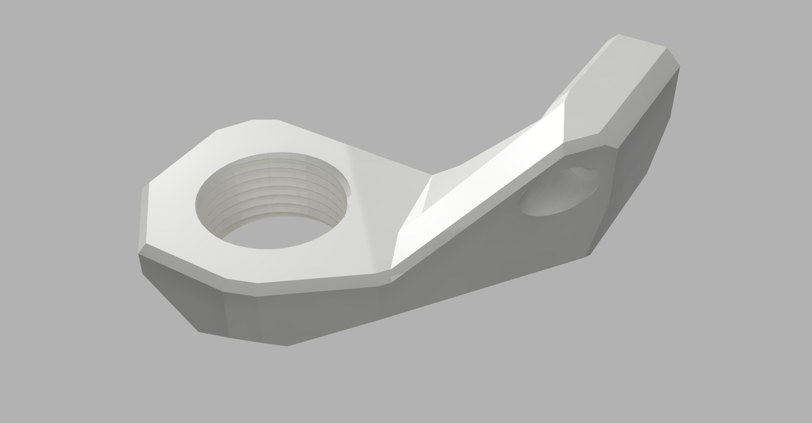
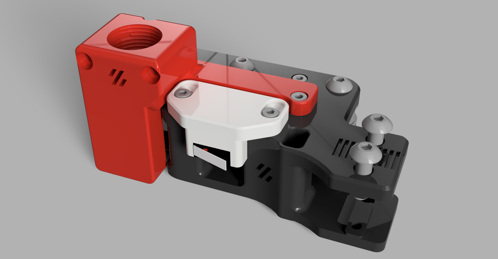

# Voron 2.4 Umbilical Mount for PG11 Threads (CNLinko LP-16)

This project provides an umbilical mount for PG-11 threads. I sourced LP-16 connectors from CNLinko and couldn't find a mount for the PG-11 thread they use, so I created one.

## Acknowledgements

Special thanks to:

- [Minsekt](https://github.com/VoronDesign/VoronUsers/tree/master/printer_mods/Minsekt/Rear_Umbilical) for the initial inspiration and sources.
- [hartk](https://github.com/hartk1213/MISC/tree/main/Voron%20Mods/Voron%202-Trident/2.4/CW2_SB2040_CAN_Umbilical) for additional sources and inspiration.

## Mount Details

The A-Drive mount consists of 2 parts, designed for two 5x3x4mm heat-set inserts (Voron standard) and 2x M3x20 SHCS. They are very close to the outer shell, so set the inserts with the lowest possible temperature or go fast to avoid melting everything.

## Files

- `PG11_Umb_A_Mount_Teil1.stl` has some errors in the threads but works perfectly. I have printed and tested all of these files.

## Images

## License

Feel free to use and modify this mount. Contributions are welcome!
